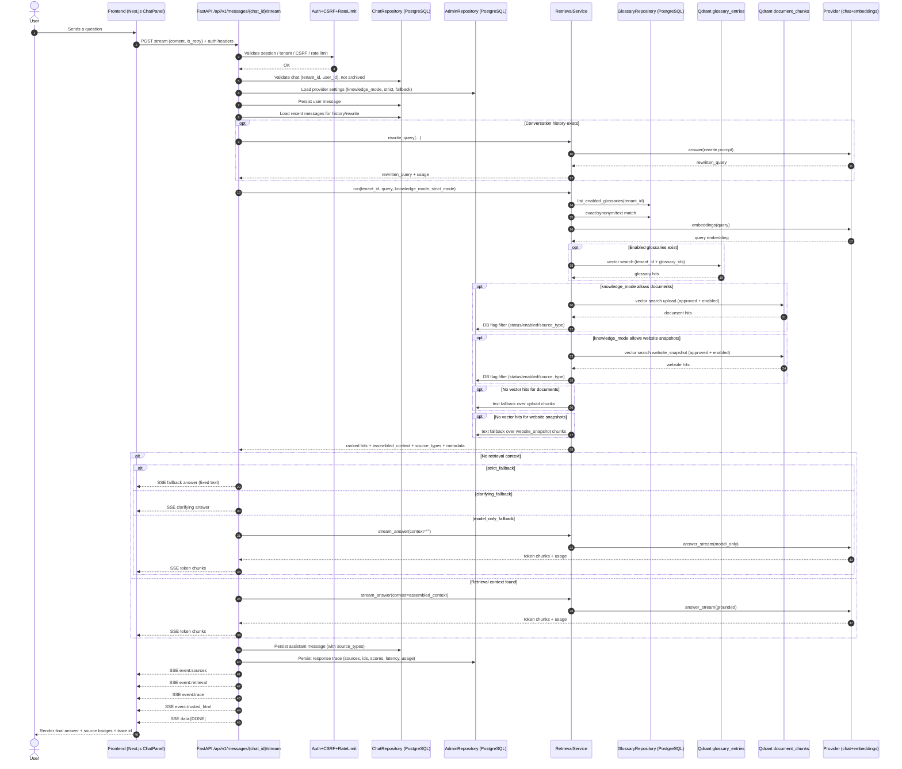

# Knowledge Assistant

Multi-tenant knowledge assistant with tenant isolation, glossary-first retrieval, document ingestion, website snapshots, an admin approval workflow, and source traceability.

## Features

- Chat UI and admin UI built with Next.js.
- Backend-driven trusted markdown rendering for assistant messages (`trusted_html`).
- Chat sidebar supports `pin`, `archive`, and `unarchive` actions.
- Backend API built with FastAPI.
- Tenant-aware storage for chats, messages, glossaries, documents, and website snapshots.
- Retrieval from three source types:
  - glossary
  - approved documents
  - approved website snapshots
- Strict runtime knowledge modes:
  - `glossary_only`
  - `glossary_documents`
  - `glossary_documents_web`
- Configurable behavior when retrieval is empty:
  - `strict_fallback`
  - `model_only_fallback`
  - `clarifying_fallback`
- Ingestion pipeline for `pdf`, `md`, and `txt`:
  - extraction
  - normalization
  - chunking
  - embeddings
  - sync to Qdrant
- Admin workflow:
  - upload/add URL
  - ingestion
  - preview
  - approve
  - archive
  - reindex
  - delete
  - enable/disable in retrieval
- Response trace:
  - `knowledge_mode`
  - `source_types`
  - `document_ids`
  - `web_snapshot_ids`
  - `ranking_scores`

## Current Retrieval Pipeline

1. Query normalization.
2. Glossary exact match.
3. Glossary synonym match.
4. Glossary text/semantic retrieval.
5. Document semantic retrieval over approved chunks.
6. Website snapshot retrieval over approved chunks.
7. Unified ranking.
8. Prompt context assembly based on source priority.
9. Answer generation by the model.

Ranking priority:

- glossary > documents > websites > model

## Sequence Diagram (Request -> Response)



## Knowledge modes

- `glossary_only`: only the glossary is allowed.
- `glossary_documents`: glossary + approved documents are allowed.
- `glossary_documents_web`: glossary + approved documents + approved website snapshots are allowed.

## Empty retrieval modes

- `strict_fallback`: return a fixed fallback answer without calling the model.
- `model_only_fallback`: call the model without knowledge context and clearly label that the knowledge base had no match.
- `clarifying_fallback`: return a clarifying question instead of a pseudo-grounded answer.

## Knowledge Source Statuses

Documents and website snapshots use these statuses:

- `draft`
- `processing`
- `approved`
- `archived`
- `failed`

Only records that satisfy all of the following conditions participate in retrieval:

- `status = approved`
- `enabled_in_retrieval = true`

After ingestion, a source remains in `draft` and requires explicit admin approval before it is published to retrieval.

## Tech Stack

- Frontend: `Next.js 16`, `React 19`, `TypeScript 6`, `Tailwind CSS 4`
- Backend: `FastAPI`, `SQLAlchemy`, `Alembic`, `Pydantic 2`
- Auth: `Keycloak` + OIDC, JWT validation via `PyJWT`
- Data: `PostgreSQL`, `Redis`
- Vector search: `Qdrant`
- AI providers:
  - chat/rewrite: `OpenRouter`-compatible API
  - embeddings: OpenRouter or dedicated embeddings provider (for example GigaChat)
- Document parsing: `pypdf`, `BeautifulSoup4`
- Infra/runtime: `Docker Compose`, `Nginx`
- Tests/tooling: `pytest`, `Vitest`, `ESLint`

## Project Structure

```text
.
├── backend/
│   ├── alembic/
│   │   ├── env.py
│   │   └── versions/                  # database migrations
│   ├── app/
│   │   ├── api/
│   │   │   ├── deps.py               # DI, auth deps
│   │   │   └── v1/
│   │   │       ├── admin.py          # admin API, documents/sites/provider/traces
│   │   │       ├── auth.py           # auth, oidc, register
│   │   │       ├── chats.py          # chat CRUD
│   │   │       ├── glossary.py       # glossary CRUD/import
│   │   │       ├── messages.py       # message streaming, retrieval, trace
│   │   │       └── router.py
│   │   ├── core/
│   │   │   ├── config.py             # application settings
│   │   │   ├── errors.py             # error envelope / handlers
│   │   │   ├── logging_utils.py      # redaction, safe logging
│   │   │   ├── markdown_security.py  # markdown normalization + safe HTML rendering
│   │   │   ├── rate_limit.py
│   │   │   ├── secret_crypto.py
│   │   │   └── security.py
│   │   ├── db/
│   │   │   ├── base.py
│   │   │   └── session.py
│   │   ├── models/
│   │   │   └── models.py             # SQLAlchemy models
│   │   ├── repositories/
│   │   │   ├── admin_repository.py
│   │   │   ├── chat_repository.py
│   │   │   └── glossary_repository.py
│   │   ├── schemas/
│   │   │   ├── admin.py              # Pydantic schemas for admin/documents/sites
│   │   │   ├── chat.py
│   │   │   └── glossary.py
│   │   ├── services/
│   │   │   ├── document_service.py   # ingestion, chunking, qdrant sync
│   │   │   ├── provider_service.py   # OpenRouter-compatible provider
│   │   │   ├── retrieval_service.py  # unified retrieval/ranking/prompt building
│   │   │   ├── vector_service.py     # Qdrant adapter
│   │   └── main.py                   # FastAPI app, startup, qdrant collections
│   ├── tests/                        # contract/unit tests backend
│   ├── requirements.txt
│   ├── requirements-dev.txt
│   ├── alembic.ini
│   ├── entrypoint.sh                 # container bootstrap (CA trust refresh)
│   └── Dockerfile
├── frontend/
│   ├── src/
│   │   ├── app/
│   │   │   ├── admin/                # admin page
│   │   │   ├── auth/                 # auth pages + callback
│   │   │   ├── chat/                 # chat page
│   │   │   ├── favicon.ico           # browser favicon fallback
│   │   │   ├── icon.svg              # primary app icon (document + spark)
│   │   │   ├── logout/
│   │   │   ├── register/
│   │   │   ├── globals.css
│   │   │   ├── layout.tsx            # metadata + icon links
│   │   │   └── page.tsx
│   │   ├── components/
│   │   │   ├── admin-panel.tsx       # admin UI, knowledge base, provider settings
│   │   │   ├── chat-panel.tsx        # chat UI
│   │   │   ├── brand-title.tsx
│   │   │   ├── source-badges.tsx
│   │   │   ├── auth/
│   │   │   └── ui/
│   │   └── lib/
│   │       ├── api.ts
│   │       └── auth.ts
│   ├── package.json
│   └── Dockerfile
├── ops/
│   ├── certs/                        # optional custom CA bundle for embeddings TLS
│   ├── keycloak/realm-import/        # realm import
│   ├── keycloak/themes/              # optional custom Keycloak themes
│   └── nginx/                        # nginx configs
├── scripts/
│   ├── seed.py
│   ├── reindex_glossary_vectors.py
│   ├── reconcile_qdrant_index.py
│   ├── bootstrap-keycloak-local.sh
│   ├── configure-keycloak-client.sh
│   ├── check-auth-config.sh
│   └── init-dbs.sh
├── docker-compose.yml
├── docker-compose.prod.yml
└── .env.example
```

## Core Backend Entities

- `glossaries`
- `glossary_entries`
- `documents`
- `document_chunks`
- `document_ingestion_jobs`
- `provider_settings`
- `response_traces`
- `audit_logs`
- `error_logs`
- `messages`
- `chats`

## Documents And Ingestion

Knowledge sources are stored in `documents`.

Supported source types:

- `upload`
- `website_snapshot`

Supported upload formats:

- `pdf`
- `md`
- `txt`
- glossary import: `csv` only

Upload file limits:

- `50 MB` at the backend layer
- `50 MB` at the nginx `client_max_body_size` layer
- `10 MB` for glossary CSV import

Documents and website snapshots can store free-form tags in `metadata_json.tags`, filter by them in the admin UI, and be enabled or disabled for retrieval.

`website_snapshot` indexes only the exact page referenced by the provided URL. There is no automatic domain crawl or internal link traversal. Only `https` URLs that resolve to public IP addresses are allowed, redirects must stay on the exact same host, and non-HTML responses are rejected.

Ingestion performs:

- text extraction
- Markdown/plain/PDF cleanup
- whitespace normalization
- empty block removal
- `page` and `section` metadata preservation
- overlap-aware chunking
- embeddings for each chunk
- writes to `document_chunks`
- writes the following payload to Qdrant:
  - `tenant_id`
  - `document_id`
  - `chunk_id`
  - `source_type`
  - `title`
  - `status`
  - `page`
  - `section`
  - `web_snapshot_id`
  - `domain`
  - `url`

Chunking note:

- chunking is character-budget based (`DOCUMENT_CHUNK_SIZE_CHARS` + overlap)
- oversized single paragraphs are additionally split during chunking to avoid oversized embedding payloads

## Core APIs

### User API

- `POST /api/v1/messages/{chat_id}/stream`
  - SSE events:
    - token chunks via `data: ...`
    - `event: sources`
    - `event: retrieval`
    - `event: trace`
    - `event: trusted_html` (backend-rendered safe HTML for assistant output)
- `GET /api/v1/chats`
  - query params:
    - `include_archived` (default `false`)
- `POST /api/v1/chats`
- `GET /api/v1/chats/{chat_id}`
  - includes `messages[].trusted_html` for assistant messages
- `PATCH /api/v1/chats/{chat_id}`
- `DELETE /api/v1/chats/{chat_id}`

### Auth API

- `GET /auth/register/config`
- `GET /auth/register/captcha`
- `POST /auth/register`
  - registration UI includes real-time password requirements + strength meter
- `POST /auth/oidc/exchange`
- `POST /auth/oidc/refresh`
- `POST /auth/logout`
- `GET /auth/session`

### Glossary API

- `GET /api/v1/glossary`
- `POST /api/v1/glossary`
- `PATCH /api/v1/glossary/{glossary_id}`
- `DELETE /api/v1/glossary/{glossary_id}`
- `GET /api/v1/glossary/{glossary_id}/entries`
- `POST /api/v1/glossary/{glossary_id}/entries`
- `PATCH /api/v1/glossary/{glossary_id}/entries/{entry_id}`
- `DELETE /api/v1/glossary/{glossary_id}/entries/{entry_id}`
- `POST /api/v1/glossary/{glossary_id}/import-csv`

### Admin API

- `GET /api/v1/admin/provider`
- `PUT /api/v1/admin/provider`
- `GET /api/v1/admin/traces`
- `GET /api/v1/admin/logs`
- `GET /api/v1/admin/documents`
  - supports pagination and filtering via query params:
    - `page` (default `1`)
    - `page_size` (default `50`, max `200`)
    - `source_type`, `status`, `search`, `tag`
  - response shape:
    - `items`: list of documents
    - `total`: total matched rows
    - `page`
    - `page_size`
- `POST /api/v1/admin/documents/upload`
- `GET /api/v1/admin/documents/tags`
- `GET /api/v1/admin/documents/{document_id}`
- `PATCH /api/v1/admin/documents/{document_id}`
- `POST /api/v1/admin/documents/{document_id}/approve`
- `POST /api/v1/admin/documents/{document_id}/archive`
- `POST /api/v1/admin/documents/{document_id}/reindex`
- `DELETE /api/v1/admin/documents/{document_id}`
- `POST /api/v1/admin/sites`
- `POST /api/v1/admin/qdrant/reset-all`
- `GET /api/v1/admin/registrations/pending`
- `POST /api/v1/admin/registrations/{user_id}/approve`

## Markdown Security Policy (Chat)

Assistant markdown is normalized and rendered on the backend before it reaches the client.

- backend normalizes markdown in streaming chunks and final answer (`normalize_markdown_text`, `sanitize_markdown_stream_chunk`)
- backend renders trusted HTML (`trusted_html`) using safe, limited markdown rules
- URI schemes are fail-closed via `normalize_safe_href`; only `http`, `https`, and `mailto` are allowed
- blocked links include `javascript:`, `data:`, and obfuscated/encoded unsafe schemes
- zero-width and control characters are removed to prevent hidden payload tricks
- external links are emitted with `target="_blank"` and `rel="nofollow ugc noopener noreferrer"`
- frontend chat rendering uses backend-provided `trusted_html`; it does not parse arbitrary raw HTML from model output

Relevant implementation and tests:

- `backend/app/core/markdown_security.py`
- `backend/tests/test_markdown_security.py`
- `backend/tests/test_messages_stream_contract.py`
- `frontend/src/components/chat-panel.markdown.test.ts`

## Response Trace

Each trace stores:

- model
- `knowledge_mode`
- `answer_mode`
- used glossary entry IDs
- `document_ids`
- `web_snapshot_ids`
- `source_types`
- `ranking_scores`
- latency
- usage/fallback metadata

## Local Setup

1. Create the env file:

```bash
cp .env.example .env
```

2. For local HTTP development, set:

```bash
AUTH_COOKIE_SECURE=false
```

If you run behind a reverse proxy, configure trusted proxy CIDRs for `X-Forwarded-For` parsing:

```bash
TRUSTED_PROXY_CIDRS=127.0.0.1/32,::1/128
```

3. Start the stack:

```bash
docker compose up -d --build
```

4. Configure local Keycloak:

```bash
./scripts/bootstrap-keycloak-local.sh
./scripts/configure-keycloak-client.sh
```

5. Apply the seed:

```bash
docker compose exec -T backend python /scripts/seed.py
```

`seed.py` now acts as a bootstrap for knowledge defaults:

- on first run, it creates the default glossary and provider defaults
- on later redeploys, it does not restore deleted default glossary values for an existing tenant

6. Check health:

```bash
curl http://localhost/api/v1/health
```

Main endpoints:

- UI: `http://localhost/`
- FastAPI docs: `http://localhost/api/docs`
- Keycloak admin: `http://localhost:8080`

Compose volumes in use:

- `pgdata`: PostgreSQL data
- `qdrant_data`: Qdrant storage
- `documents_data`: persistent storage for `data/documents`, so uploaded files and website snapshots survive backend container recreation

If your embeddings provider requires a non-standard trust chain, place PEM certs into `ops/certs/` and set:

```bash
EMBEDDINGS_CA_BUNDLE_PATH=/etc/ssl/certs/ca-certificates.crt
```

Backend container startup refreshes trust store from mounted certificates.

On backend startup, pending/stale ingestion jobs are recovered from `document_ingestion_jobs` and resumed automatically.

## GitHub Actions Secrets (Deploy)

For production deploy via `.github/workflows/deploy.yml` and `.github/workflows/ci-cd.yml`, configure these GitHub repository secrets.

Required:

- `VDS_HOST`
- `VDS_PORT`
- `VDS_USER`
- `VDS_SSH_KEY`
- `VDS_DEPLOY_PATH`
- `VDS_GIT_PAT`
- `DEPLOY_ENV_FILE`
- `OPENROUTER_API_KEY`
- `POSTGRES_USER`
- `APP_DB_NAME`
- `POSTGRES_PASSWORD`
- `KEYCLOAK_ADMIN_USER`
- `KEYCLOAK_ADMIN_PASSWORD`
- `PROVIDER_API_KEY_ENCRYPTION_KEY`
- `EMBEDDINGS_API_TOKEN` (for dedicated embeddings provider, e.g. GigaChat)
- `EMBEDDING_VECTOR_SIZE`

Optional:

- `HCAPTCHA_SECRET_KEY`
- `NEXT_PUBLIC_REGISTER_HCAPTCHA_SITE_KEY`

`PROVIDER_API_KEY_ENCRYPTION_KEY` is required when provider API keys are stored encrypted (`enc:v1:...`). Without it, provider settings save/decrypt and reindex scripts will fail in production.

Generate Fernet-compatible key:

```bash
python -c "from cryptography.fernet import Fernet; print(Fernet.generate_key().decode())"
```

Important:

- set one stable key and keep it unchanged across deploys
- key rotation requires re-encryption/migration of already stored provider keys
- after adding or changing secrets in GitHub, run deploy so `.env` on server is refreshed and services are restarted

## Migrations

```bash
cd backend
alembic upgrade head
```

Key migrations:

- `20260308_0001_initial.py`
- `20260309_0003_provider_show_source_tags.py`
- `20260309_0004_glossaries.py`
- `20260309_0005_glossary_single_default_constraint.py`
- `20260310_0006_provider_message_limit.py`
- `20260324_0007_documents.py`
- `20260324_0008_trace_retrieval_payload.py`
- `20260324_0009_knowledge_mode.py`
- `20260324_0010_empty_retrieval_mode.py`
- `20260325_0011_chat_context_settings.py`
- `20260325_0013_constraints_and_drop_provider_web_enabled.py`
- `20260325_0014_glossary_term_uniqueness.py`
- `20260325_0015_tenant_scoped_fk_guards.py`
- `20260325_0016_drop_allowlist_domains_legacy.py`
- `20260325_0017_documents_metadata_indexes.py`
- `20260325_0018_storage_cleanup_tasks.py`
- `20260325_0019_storage_cleanup_tasks_gc_index.py`
- `20260329_0020_chat_pin_archive_flags.py`

## Tests

Key test files:

- `backend/tests/test_document_ingestion_service.py`
- `backend/tests/test_documents_api_contract.py`
- `backend/tests/test_retrieval_and_logging.py`
- `backend/tests/test_messages_stream_contract.py`
- `backend/tests/test_glossary_api_contract.py`
- `backend/tests/test_admin_security.py`
- `backend/tests/test_auth_hardening.py`
- `backend/tests/test_chats_api_contract.py`
- `frontend/src/components/chat-panel.a11y.test.ts`
- `frontend/src/app/register.password-meter.test.ts`

If `pytest` is available:

```bash
cd backend
pytest
```

Quick syntax check:

```bash
PYTHONPYCACHEPREFIX=/tmp/pycache python3 -m compileall backend/app backend/tests scripts
```

## CI Security Gates

In GitHub Actions, the `test` pipeline runs layered security checks:

- `gitleaks` for secret leak detection
- `bandit` for Python SAST (`HIGH` severity, high confidence)
- `semgrep` for cross-language SAST (`ERROR` severity)
- `trivy` in 3 modes:
  - `vuln` (dependency vulnerabilities, `HIGH/CRITICAL`)
  - `misconfig` (infrastructure/config checks)
  - `secret` (secret detection)
- dependency audits:
  - `pip-audit -r backend/requirements.txt`
  - `pip-audit -r backend/requirements-dev.txt`
  - `npm audit --omit=dev --audit-level=high`
  - `npm audit --audit-level=high` (including dev deps)

Policy behavior:

- blocking by default: `gitleaks`, `bandit`, `semgrep`, `trivy vuln`, `trivy misconfig`, `trivy secret`
- outdated reports (`pip list --outdated`, `npm outdated`) are advisory and included in CI summary

## Dependency Review (PR)

Supply-chain review is separated into dedicated workflow:

- `.github/workflows/dependency-review.yml`
- trigger: `pull_request` to `main`
- action: `actions/dependency-review-action@v4.9.0`
- gate: `fail-on-severity: high`

This check is intentionally PR-only and does not run on direct `push` events.

## Embeddings Provider Notes

- `OPENROUTER_EMBEDDING_MODEL` can point to OpenRouter models (for example `openai/text-embedding-3-small`) or to dedicated provider model IDs (for example `Embeddings` for GigaChat).
- For GigaChat, `EMBEDDINGS_API_TOKEN` is treated as authorization key and exchanged for access token via OAuth.
- If a batch embeddings request is rejected with `413`, backend degrades to per-item requests.
- If single-item request is still rejected with `413`, backend recursively splits text and retries, then applies a conservative truncation fallback to avoid blocking ingestion/approval.
- Keep `EMBEDDING_VECTOR_SIZE` aligned with the actual embedding model dimension and Qdrant collection schema.

Operational guidance for recurring `413`:

- reduce `DOCUMENT_CHUNK_SIZE_CHARS` (for example to `900-1100`) if provider keeps rejecting larger texts
- verify document extraction quality (very long unbroken paragraphs can still push payload size)
- prefer reindexing documents after chunking settings changes

## Conversational Context

At the current stage, the backend uses chat history in two separate roles:

- for `history-aware query rewrite`, to turn a follow-up question into a standalone retrieval query
- for `bounded conversation context` in the final prompt, so the model can understand references to earlier turns

The actual grounding for the response remains:

- the current user request
- the assembled retrieval context
- the system constraints of the active knowledge mode

Conversation history is not treated as an independent knowledge source. It is used only to interpret follow-up questions and provide local conversational context. If history conflicts with retrieval context, retrieval context and system constraints take priority.

Conversational context is configured in the admin provider settings:

- `chat_context_enabled` globally enables or disables chat history usage
- `history_user_turn_limit`, `history_message_limit`, and `history_token_budget` cap the amount of history included in the final prompt
- `rewrite_history_message_limit` limits how many recent messages participate in `history-aware query rewrite`

Diagnostic fields stored in `response_traces.token_usage`:

- `chat_context_enabled`
- `rewrite_used`
- `rewritten_query`
- `history_messages_used`
- `history_token_estimate`
- `history_trimmed`
